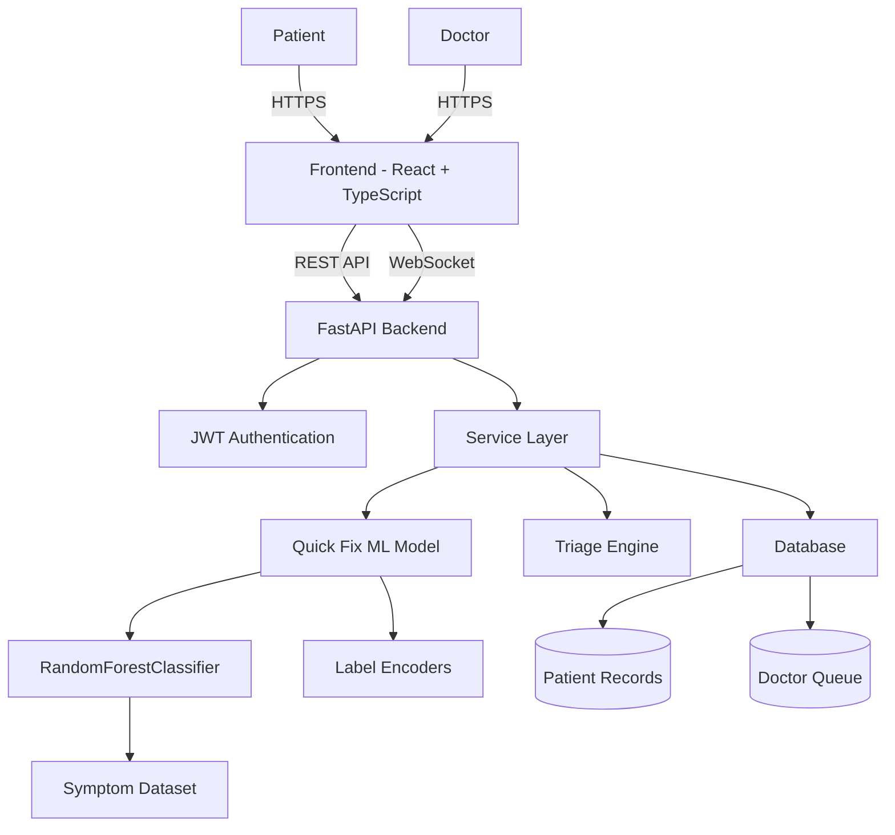

# 🧠 Mediphas AI – Intelligent Patient Triage System

**Mediphas AI** is an AI-powered clinical triage and decision-support platform designed to bridge the gap between patient anxiety and professional medical care.

Built for high-impact environments such as hospitals, emergency workflows, and national hackathons, it delivers:

- Real-time patient triage  
- AI-driven symptom intelligence  
- Doctor-prioritized live queues  
- Safe OTC recommendations  
- Modern, premium healthcare UI  

---

# 🌟 Core Value Proposition

## 🔹 Dual-Perspective Intelligence

Unlike traditional health applications that focus on either patients or doctors, **Mediphas AI unifies both experiences into a single intelligent system.**

---

## 👤 Patient Experience

- Instant AI symptom analysis  
- Automated risk classification (Normal / Urgent / Critical)  
- Safe over-the-counter guidance  
- Confidence scoring for safety  
- Personal health dashboard  
- Secure authentication system  

---

## 🩺 Doctor Experience

- Real-time prioritized live queue  
- AI-assisted diagnostic overview  
- WebSocket-based instant updates  
- Population analytics dashboard  
- Centralized medical command center  

Critical patients are automatically prioritized before they even walk in.

---

# 🧠 Quick Fix AI Engine

The **Quick Fix AI** system solves the “Dr. Google” problem.

Instead of anxiety-inducing search results, users receive:

- ✅ Instant disease probability prediction  
- ✅ Safe OTC medication suggestions  
- ✅ Confidence scoring  
- ✅ Auto-escalation for high-risk symptoms  

Low-confidence predictions are automatically flagged for professional review to maintain safety standards.

---

# 🚦 Smart Clinical Triage

Automated severity classification based on:

- Reported symptoms  
- Vital inputs  
- Severity mapping logic  

### Output Levels

- 🟢 Normal  
- 🟡 Urgent  
- 🔴 Critical  

Doctors see critical cases first through a dynamically sorted queue.

---

# 🏗️ System Architecture

## 🔷 High-Level Architecture Diagram



---

## 🧩 Architecture Breakdown

### 🖥 Frontend
- React 18  
- TypeScript  
- Vite  
- Tailwind CSS (Glassmorphism UI)  
- Context API (Auth / Theme / Notifications)  
- React Router DOM  

### ⚙️ Backend
- FastAPI (Python)  
- JWT Authentication  
- REST API  
- WebSocket Integration  
- Modular Service Layer  

### 🤖 Machine Learning Layer
- RandomForestClassifier (Scikit-learn)  
- 40+ diseases  
- 130+ symptoms  
- Model serialized using joblib (.pkl)  
- Label encoders for feature mapping  

Core Files:
- `quickfix_model.pkl`
- `label_encoders.pkl`

---

# 🚀 Getting Started

## 1️⃣ Backend Setup

```bash
cd triageai-backend
python -m venv .venv
source .venv/bin/activate  # Windows: .venv\Scripts\activate
pip install -r requirements.txt

# Train AI Model
python ml/train_quickfix.py

# Start Server
uvicorn app.main:app --reload --port 8000
```

---

## 2️⃣ Frontend Setup

```bash
cd mediphas-ai-frontend
npm install
npm run dev
```

---

## 🌐 Access Application

Open your browser:

```
http://localhost:3000
```

---

# 🏆 Hackathon Advantage

Mediphas AI stands out because:

- Real ML model (not rule-based demo logic)  
- End-to-end working healthcare pipeline  
- Dual dashboard (Patient + Doctor)  
- Real-time WebSocket queue prioritization  
- Clean enterprise-grade architecture  
- Modern, premium UI design  
- Built-in AI safety escalation logic  

---

# 🔒 Medical Disclaimer

Mediphas AI is intended for educational, triage assistance, and decision-support purposes only.  
It does not replace licensed medical professionals.  
Always consult a qualified healthcare provider for medical advice.

---

# 👨‍💻 Built By

**Ajay Kumar Reddy**

---

# 📌 Repository Description (Paste Into GitHub Description Field)

AI-powered intelligent patient triage and clinical decision-support platform with real-time doctor queue and ML-driven symptom analysis.
