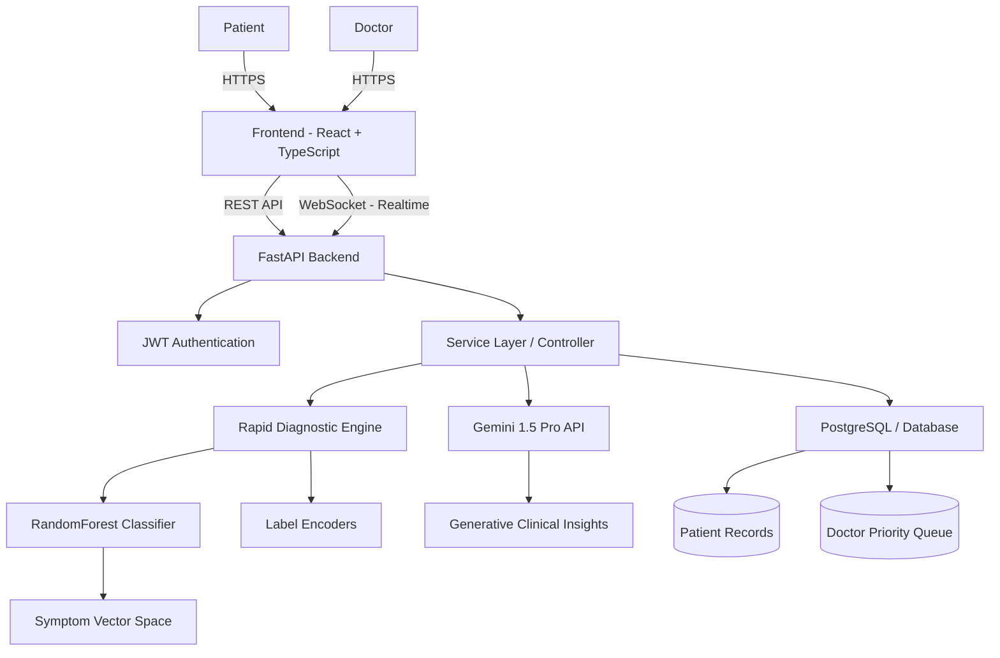

# 🧠 Medyphas AI – Intelligent Patient Triage System

  

**Medyphas AI** is a next-generation clinical triage and decision-support platform designed to bridge the gap between patient anxiety and professional medical care using a **Hybrid AI Architecture**.

Built for high-impact environments such as hospitals and emergency workflows, it delivers:

- ⚡ **Real-time Patient Triage** (WebSocket-powered live queues)
- 🧠 **Hybrid AI Intelligence** (Random Forest + Google Gemini 1.5 Pro)
- 🏥 **Doctor-Prioritized Command Center**
- 🛡️ **Safety-First Clinical Logic**
- 🎨 **Claymorphism Healthcare UI**

---

# 🌟 Core Value Proposition

## 🔹 Dual-Perspective Intelligence

Unlike traditional health applications that focus on either patients or doctors, **Medyphas AI unifies both experiences into a single intelligent ecosystem.**

### 👤 Patient Experience
- **Instant Symptom Analysis:** Powered by our Rapid Diagnostic Engine (<10ms response).
- **Automated Risk Classification:** Real-time categorization (**Normal** / **Urgent** / **Critical**).
- **Generative Health Insights:** Detailed, context-aware explanations via **Gemini 1.5 Pro**.
- **Personal Health Dashboard:** Secure tracking of vitals and history.

### 🩺 Doctor Experience
- **Live Triage Command Center:** Auto-sorted queues based on severity, not arrival time.
- **AI-Assisted Diagnostics:** Pre-generated clinical summaries for faster decision-making.
- **Real-Time Vitals Monitoring:** Instant WebSocket updates from patient inputs.
- **Population Analytics:** Macro-level view of disease trends.

> *Critical patients are automatically flagged and prioritized before they even enter the consultation room.*

---

# ⚡ The Hybrid AI Engine

Medyphas AI utilizes a **Hybrid Intelligence Model** to combine speed with reasoning.

### 1. The Fast Layer (Triage Engine)
A high-performance classifier for immediate risk assessment:
- ✅ **Instant Severity Mapping:** Assigns Red/Yellow/Green codes instantly.
- ✅ **Structural Symptom Encoders:** Maps raw inputs to 130+ clinical vectors.
- ✅ **Safety Protocol:** Auto-escalation for high-risk symptoms (e.g., chest pain).

### 2. The Deep Layer (Generative Clinical Core)
Powered by **Google Gemini 1.5 Pro**, this layer handles complex medical reasoning:
- 🧠 **Contextual Analysis:** Understands patient history nuances.
- 💊 **Pharmacological Safety:** Cross-checks OTC recommendations against contraindications.
- 📝 **Clinical Summarization:** Generates SOAP notes for doctors automatically.

---

# 🏗️ System Architecture

## 🔷 High-Level Architecture Diagram

🧩 Tech Stack & Engineering
🖥 Frontend (Client)
Framework: React 18 + TypeScript + Vite

Styling: Tailwind CSS (Custom Glassmorphism UI)

State Management: Context API (Auth / Theme / Notifications)

Routing: React Router DOM v6

⚙️ Backend (Server)
Framework: FastAPI (Python 3.10+) - Async High Performance

Real-Time Data: Native WebSocket Implementation for Live Queues

Security: JWT (JSON Web Tokens) + Bcrypt Hashing

Architecture: Modular Service-Repository Pattern

🤖 Machine Learning Layer
Triage Model: Scikit-learn Random Forest (Trained on 40+ diseases, 130+ symptoms)

Generative Core: Google Gemini 1.5 Pro (via Google AI Studio API)

Serialization: Joblib optimized model persistence (.pkl)

💼 Business & Clinical Impact (B2B SaaS Model)
Medyphas AI isn't just a technical prototype; it's designed for enterprise healthcare deployment:

Total Addressable Market (TAM): $650B Global Digital Health Market.

Serviceable Addressable Market (SAM): $180B AI in Healthcare Market (by 2030).

Hospital ROI: Reduces average patient waiting room time, mitigates clinical burnout, and ensures critical patients are seen faster, lowering malpractice risk.

🚀 Getting Started
1️⃣ Backend Setup
Bash
cd triageai-backend
python -m venv .venv
source .venv/bin/activate  # Windows: .venv\Scripts\activate
pip install -r requirements.txt

# Configure Environment
# Create a .env file and add your GEMINI_API_KEY

# Train Local Triage Model
python ml/train_model.py

# Start High-Performance Server
uvicorn app.main:app --reload --port 8000
2️⃣ Frontend Setup
Bash
cd mediphas-ai-frontend
npm install
npm run dev
🌐 Access Application
Open your browser to http://localhost:3000

🔒 Medical Disclaimer
Medyphas AI is intended for educational, triage assistance, and decision-support purposes only. It does not replace licensed medical professionals. Always consult a qualified healthcare provider for medical advice.

👨‍💻 Built By
Ajay Kumar Reddy - Full Stack Developer & AI Engineer
